# Requirements and Specification Document

## InvoTech

## Team Members

| Member  | Roles                                 |
|---------|---------------------------------------|
| Jingyu  | Database Administrator (DBA), Backend |
| Tina    | Database, Backend                     |
| David   | Database, Backend                     |
| Cade    | Backend                               |
| Mihailo | Frontend                              |
| Lukasz  | Frontend                              |

### Project Abstract

<!--A one-paragraph summary of what the software will do.-->

T_35's project will be an inventory management system. We are using Home Depot as our fictitious
customer. All implementation decisions will be catered to serving Home Depot's needs. The application
will track products across multiple Home Depot Locations. Shipments will be recorded and tracked
through the application.

### Customer

<!--A brief description of the customer for this software,
both in general (the population who might eventually use such a system)
and specifically for this document (the customer(s) who informed this document).
Every project will have a customer from the CS506 instructional staff.
Requirements should not be derived simply from discussion among team members.
Ideally,
your customer should not only talk to you about requirements
but also be excited later in the semester to use the system.-->

| ID  | Description                                                                                                                                                                                                                                                                                                                                                                                                             | Priority | Status |
|-----|-------------------------------------------------------------------------------------------------------------------------------------------------------------------------------------------------------------------------------------------------------------------------------------------------------------------------------------------------------------------------------------------------------------------------|----------|--------|
| R01 | Upon clicking on the facilities pages, the front will populate the page with all facility information including name, location, and site_status.                                                                                                                                                                                                                                                                        | High     | Open   |
| R02 | From the facilities page, the user must be able to select a button to remove a facility. After clicking the removal button, the user will be prompted to add a cease date. Upon clicking complete, the backend will update the facility's cease date. After navigating to the facility pages, the front end will populate the facilities table, but the recently seized facility will not be there.                     | High     | Open   | 
| R03 | From the inventory page, the user will be able to click on a button to add items. Upon clicking the add items button, they will be prompted to add the a product ID, name, quantity, and site the items belong to. If the item already exists in the database, the new quantity is added to the existing quantity. If the item is not in the database, and a brand new entry is populated.                              | High     | Open   |
| R04 | Upon loading the shipments page, the front end will display a list of all shipments. The list will contain each shipment's destination, source, arrival time (or estimated arrival time), departure time, current location, and the status of the shipment.                                                                                                                                                             | High     | Open   |
| R05 | If a shipment is completed, the database must be auto-populated with items attached to that shipment. The shipment's status must also be updated to completed and the arrival time should be replaced with the time of its completion.                                                                                                                                                                                  | High     | Open   |
| R06 | A user must be able to perform an audit from a start date and an end date. The front end will receive the two dates, and the back end will begin generating a list of all of the changes to the system since the start date. The information will be returned to the front and displayed in chronological order.                                                                                                        | Med      | Open   |
| R07 | The system should allow for the import and export of inventory and shipment data via spreadsheets.                                                                                                                                                                                                                                                                                                                      | Med      | Open   |
| R08 | From the sites page, a user must be able to change to a geospatial view of the sites. The front end will retrieve the coordinates of all the sites from the database and populate a map using their coordinates to place the sites.                                                                                                                                                                                     | Low      | Open   |
| R09 | A user must have the option to set notifications for certain events. The user will be able to select a user profile page and navigate to the notifications sub-page from there. They will be able to add notifications for various events that occur in the database. The events include critical inventory levels (the threshold will be set by the user) and shipments not arriving by their estimated arrival date.  | Low      | Open   |
| R10 | Users should not have to sign into the system after initially logging in; their current network login should be used for identification.                                                                                                                                                                                                                                                                                | High     | Open   |
| R11 | From the inventory page, filters must be able to be applied to sort products. This includes sites, certain products, and quantity thresholds.                                                                                                                                                                                                                                                                           | High     | Open   |
| R12 | From the shipments page, a user should be able to filter the shipments by product. Upon entering a product ID, the front end will display only shipments that contain that product.                                                                                                                                                                                                                                     | High     | Open   |               
| R13 | From the inventory page, users must be able to select a changes or time option. The user will then enter the start and end date, and the facilities to be included. The front end will display the changes in inventory over this period. These changes include the net gain or net loss of items in the inventory between all of the facilities selected by the user.                                                  | High     | Open   |   
| R14 | From the shipments page, a user must be able to modify specific shipments. Upon selection, the user will be able to change the shipments, arrival date, estimated arrival date, and current shipment status.                                                                                                                                                                                                            | High     | Open   |   
| R15 | From the inventory pages, the user must be able to select two facilities to perform a diff on. After selecting the two facilities, a page will be generated showing the differences in inventory between the two facilities.                                                                                                                                                                                            | High     | Close  |
| R16 | From the facilities page, the user will be able to click a button to add a new site. After setting the name, location, status, and internal site bit, and clicking confirm, the database must be updated with the new facility. After navigating back to the sites page, the list of sites displayed should include the newly created site.                                                                             | High     | Open   |
| R17 | From the inventory page, the user must be able to generate a spreadsheet from their current view of inventory. This includes all of the filters they have set. They should also be able to generate spreadsheets from both the inventory diff page and the changes over time page. After the backend has generated the spreadsheet, the user must be able to download its directory from the browser.                   | Low      | Open   |
| R18 | From the login page and user will be able to create a new account. They will be able to select between corporate manager and facility manager roles. After including a username, password, and email, and clicking confirm, the system will be updated to grant access to this user. The db will be updated with the user. After navigating back to the login page, they will be able to log in with their new account. | Low      | Open   |
| R19 | A Gitlab pipeline should run in merge requests to confirm that tests passed, codes meets style guides standards, and docker images can be built.                                                                                                                                                                                                                                                                        | High     | Open   |

### Use Cases & User Stories

All user stories are listed in order of priority.
Under each user story is a list of the requirements they fulfill and an acceptance test.

#### _Initial Project_

#### As a corporate manager, I want to see a list of my facilities.

> _R01_
>
> The user will select a site page. The page will be populated with a list of their facilities.

#### As a corporate manager, I want to create a new facility.

> _R16_
>
> The user will be able to click a button to add a facility.
> After adding the facility, their list of facilities will contain the new facility.

#### As a corporate manager, I want to mark that a facility has ceased operation as of some date. I don't want that facility included in aggregates after that date.

> _R02_
>
> The user will be able to navigate to the site page, click on a facility,
> and have the option to cease the operation of the facility.
> After ceasing a site,
> the inventory of that site should not be included in the aggregate of inventory across all facilities.

#### As a corporate manager, I want to see my facilities represented on a map.

> _R08_
>
> The user will navigate to a page with a map representation of the facilities.
> Facilities will be placed on a map relative to their location stored in the database.

#### As a facility manager, I want to be able to populate my facility with products.

> _R03_
>
> From the inventory page, the user will click on the Add inventory button.
> A new window will prompt them to enter the product id, name, quantity, and facilities to populate with the item.
> After confirming, the inventory page will include the new added product.

#### As a facility manager, I want to view what I have in my facility's inventory.

> _R11_
>
> The user will be able to navigate to an inventory page.
> They can choose to filter by a single facility, and the inventory of that facility will be displayed.

#### As a corporate manager, I want to see all the sites that contain the given items.

> _R12_
>
>The user will be able to select a site page, filter by items, and see all the sites that contain the items.

#### As a corporate manager, I want to filter sites by all attributes.

> _R15_
>
> The user will be able to select a site page, filter by all site attributes (e.g., siteName, siteID, status),
> and see all the sites under this filter

#### As a facility manager, I want to record a shipment that has arrived or left the facility, including the quantities of items in that shipment, and I want this to automatically update my inventory.

> _R04 R05_
>
> The user will be able to navigate to the Shipments page.
> They will click a button that allows them to add a new shipment.
> They will specify the source and destination facilities,
> which items will be transferred, and the date the shipment will start and be completed.
>
> The user will be able to navigate to the Shipments page.
> Upon marking a shipment as complete, the inventory of that facility will automatically be updated.

#### As a facility manager, I want to view all shipments (completed, routed, and planned).

> _R04_
>
> The user will be able to select a Shipments page and view details of all shipments.

#### As a facility manager, I want to see a list of shipments that contain a particular product.

> _R12_
>
> The user will be able to navigate to the Shipments page.
> They will filter shipments by-products.
> Only shipments containing that product will be populated on the page.

#### As a facility manager, I want to receive an audit trail of all the events applied to the system.

> _R06_
>
> The user will be able to set two dates: a start date and an end date.
> Upon selecting these two dates and system will begin to perform the audit.
> The front end will be populated with the audit once it is completed.

#### As a corporate manager, I want to see an aggregate of the inventory that has come into and gone out from all facilities over an arbitrary period.

> _R13_
>
> The user will navigate to an inventory page.
> They will set a start and end date.
> After confirming the date, a new page
> will be loaded containing all the differences in inventory between those two dates.
> The page will now net gains or net losses of the product.

#### As a developer, I want to have a GitLab Pipeline that runs in all of my pipelines that runs tests, linters, and builds docker images for deployment.

> _R19_
>
> The developer will open a MR, make a commit, and a pipeline will be triggered.
> They will be able to navigate to the pipeline and see jobs running for tests, linters,
> and building the application in to a docker container.

#### _Realistic Extensions_

#### As a user, I want to be able to update the status of shipments throughout their lifetime.

> _R14_
>
> The user will navigate to the Shipments page, select a shipment,
> and be able to change the shipment status (in-route, arrived, unloading, loading, completed).

#### As a user, I want to record incoming shipments by importing a file containing all the necessary details.

> _R07_
>
> The user will navigate to the record shipment page, and select import shipment, they will choose
> a file containing all the shipment details, and the shipment will be recorded.
> The user will now be able to navigate to the Shipments page and find the shipment they added.

#### As a user, I want to export inventory details to a familiar file format.

> _R17_
>
> The user will be able to select an inventory page, filter by location, and select an export of the table.
> The user will receive an Excel file providing the details.

#### As a user, I want to receive notifications that I personalize for different events within the system

> _R09_
>
> The user will be able to navigate to their profile page and select a notification tab.
> After settings a new notification, once the trigger has occurred,
> the user will notice their new email containing information about the trigger event.

#### _Reach Goal_

#### As a user, I want to log in to my existing account from the login page.

> _R10_
>
> The user will be greeted by a login page.
> They will enter their username and password, and be granted entry only if they were authenticated.

#### As a user, I want to create a new account from the login page.

> _R18_
>
> The user will be greeted by a login page. They will select the option to create a new account.
> They will enter their information and create an account. Now the user will be able to use the login
> page to log into this new account. They will enter their username and password and will be granted
> entry upon being authenticated.

### User Interface Requirements

#### Login Page

- The login page should display a form for users to enter their credentials.
- There should be options to log in or create a new account.

#### Home Page

- The home page should display options to view inventory and shipments.
- There should be a search bar to search for specific items or shipments.

#### Inventory Page

- The inventory page should display a table showing inventory levels across all locations.
- Users should be able to filter inventory by location.
- There should be options to view details of specific inventory items.
- Users should be able to navigate to the record shipment page from here.

#### Shipments Page

- The Shipments page should display a table showing all shipments with their status (completed, in-route, planned).
- Users should be able to filter shipments by status.
- There should be options to view details of specific shipments.
- Users should be able to navigate to the record shipment page from here.

#### Inventory Details Page

- This page should display detailed information about a specific inventory item.
- It should show the audit trail of the item, including all locations it has been in and related shipments.

#### Shipments Details Page

- This page should display detailed information about a specific shipment.
- Users should be able to update the status of the shipment from this page.

#### Record Shipment Page

- Users should be able to manually enter shipment details on this page.
- After recording a shipment, users should be redirected to the Shipments page.

#### Audit Trail Page

- This page should display the audit trail of a specific inventory item.
- It should show all transactions related to the item, including shipments and location changes.

### Security Requirements

This section of the documentation outlines the security requirement for the development of an Inventory Management
System.
This security requirement applies to all the components of the Inventory Management System including but not limited to
web application, database, backend and any associated services or APIs.
The Inventory Management System must comply with applicable legal and regulatory requirements,
including GDPR for data protection and privacy.
Additionally, adhere to industry best practices and standards, such as OWASP Top 10 for web application security.

Security Objectives

- Confidentiality: Ensure sensitive information including inventory data, user credentials, and site information is
  accessible to only authorized personnel
- Integrity: Guarantee the accuracy and completeness of data throughout its lifecycle.
- Availability: Ensure that the data system and its information are available to authorized users when needed.
- Authentication: Authorize and verify the users accessing the system.
- Authorization: Restrict users’ access to system functionalities based on their roles and specific responsibilities.

Security Controls

- Data Encryption: Implement Transpose Layer Security for all data in transit between client and server.
  Use AES-256 encryption for data at rest, particularly for sensitive information stored in the MySQL database.
- Access Control: Use role-based access control when user access to system functionalities.
  Ensure the users are granted the fewest privileges necessary for their role.
- Authentication: Implement secure authentication mechanisms such as JSON Web Tokens to manage user sessions and protect
  against unauthorized access.
- Input Validation: Ensure all user inputs in both Frontend and Backend are validated to prevent SQL injection,
  cross-site scripting, and other injection attacks.
- Secure Coding Practices: Follow secure coding guidelines for Java, React, and SQL.
  Utilize static and dynamic code analysis tools to identify and remediate vulnerabilities during the development phase.
- Database Security: Harden the MySQL database against attacks by using prepared statements for database access,
  encrypting sensitive data, and implementing access controls at the database level.
- Dependency Management: Use Maven to manage project dependencies, ensuring that all third-party libraries and
  frameworks are kept up to date to avoid known vulnerabilities.
- Audit Logging: Implement comprehensive logging of user actions, system changes, and access attempts to facilitate
  monitoring and forensic analysis.
  Ensure logs are stored securely and protected from tampering.
- Incident Response Plan: Develop and document an incident response plan detailing procedures for detecting, reporting,
  and responding to security incidents.
- Security Audits: Conduct regular security audits, at least bi-annually, to assess compliance with these security
  requirements.
- Vulnerability Assessments: Perform vulnerability assessments and penetration testing on the Inventory Management
  System annually and after any significant changes to the system or its environment.
- Remediation Timeframe: Address critical vulnerabilities within 7 days of discovery and all other vulnerabilities
  within 10 days.

### System Requirements

<!--List here all the external entities, other than users, on which your system will depend.
For example, if your system inter-operates with sendmail, or if you will depend on Apache for the web server,
or if you must target both Unix and Windows, list those requirements here.
List also memory requirements, performance/speed requirements, data capacity requirements, if applicable.-->

##### Functional Requirements

| behaviour and functions | Description                                                                                                                                                                                                                                                                                                                                                                                                                                                         |
|-------------------------|---------------------------------------------------------------------------------------------------------------------------------------------------------------------------------------------------------------------------------------------------------------------------------------------------------------------------------------------------------------------------------------------------------------------------------------------------------------------|
| Product management      | - The system must allow corporate managers to view the total count of facilities   - The system must allow corporate managers to create new facilities   - The system must Allow Corporate managers to mark a facility as ceased, ensuring it is excluded from aggregates after a specified date   - The system must be able to Create a visual representation of facilities on a map                                                                      |
| Inventory Management    | -The system must allow facility managers to access a dedicated page for viewing the inventory of their facilities   - The system must allow corporate managers  to view combined inventory levels across multiple facilities   - The system must allow Corporate managers to view differences in inventory levels across multiple facilities                                                                                                                  |   
| Shipment Management     | - The system must allow facility managers to record scheduled shipments   - The system must allow Facility managers to record shipments that have arrived or left the facility, and this action should automatically update the inventory   - The system must allow Facility managers to access a shipments page to view details of all shipments   - The system must allow Facility managers to see a list of shipments that contain a particular product |          
| Audit Trail             | - The system must allow facility managers and users to receive an audit trail for a specific entity, detailing product locations and relevant shipment information                                                                                                                                                                                                                                                                                                  |    

##### Non-Functional Requirements

| Category    | Description                                                                                                                 |
|-------------|-----------------------------------------------------------------------------------------------------------------------------|
| Performance | - The system should deliver a responsive user experience, especially when handling inventory and shipment data.             |
| Security    | - Access to sensitive information, including facility counts and inventory levels, must be secure and role-based.           |
| Reliability | - The system must incorporate backup and recovery mechanisms to prevent data loss and ensure continuous availability        |
| Usability   | - The user interface should be intuitive, facilitating easy navigation for corporate managers, facility managers, and users |
| Scalability | - The system must scale effectively to accommodate an increasing number of facilities, users, and transactions.             |

### Specification

<!--A detailed specification of the system. UML, or other diagrams, such as finite automata, or other appropriate specification formalisms, are encouraged over natural language.-->

<!--Include sections, for example, illustrating the database architecture (with, for example, an ERD).-->

<!--Included below are some sample diagrams, including some example tech stack diagrams.-->

#### Technology Stack

#### Frontend Flowchart

#### Frontend Sequence Diagram

#### Frontend Flowchart

#### Database

#### Class Diagram

```mermaid 
---
title: Inventory Management System Class Diagram
---

classDiagram
    class siteController {
        +getSites()
        +getSite(id: INTEGER)
        +addSite(site: Site)
        +deleteSite(site: Site)
        +getStatus(id: INTEGER)
        +updateSiteStatus(id: INTEGER, site: Site, status: STRING)
        +updateSiteName(id: INTEGER, site: Site)
        +updateCeaseDate(id: INTEGER, site: Site, date: Timestamp)
    }

    class AvailabilityController {
        +getAvailabilities()
        +getAvailability(siteId: INTEGER, itemId: INTEGER)
        +addAvailability(availability: Availability)
        +updateAvailability(siteId: INTEGER, itemId: INTEGER, availability: Availability)
    }

    class ItemController {
        +getItems()
        +getItem(id: INTEGER)
        +getItemDifference(item1: Item, item2: Item, site1: Site, site2: Site)
        +addItem(item: Item)
        +deleteItem(item: Item)
        +updateItem(id: INTEGER, item: Item)
    }

    class ShipController {
        +getShipInfo()
        +getShipItem(itemId: INTEGER, shipmentsId: INTEGER)
        +addShip(ship: Ship)
        +deleteShip(ship: Ship)
        +updateShip(itemId: INTEGER, shipmentsId: INTEGER, ship: Ship)
        +updateActualArrival()
        +updateDestination()
        +updateEstimatedArrival()
        +updateShipmentStatus()
        +updateDepartTime
        +updateSource()
    }

    class ShipmentController {
        +getShipments()
        +getShipment(id: INTEGER)
        +addShipment(shipment: Shipment)
        +updateShipment(id: INTEGER, shipment: Shipment)
    }

    class AuditController {
        +getAudits()
        +getAudit(id: INTEGER)
        +deleteAudit(id: INTEGER)
    }

    class UserController {
        +getUsers()
        +getUser(id: INTEGER)
        +addUser(user: User)
        +updateUser(id: INTEGER, user: User)
    }
```

#### Backend Flowchart

#### Behavior

### Standards & Conventions

<!--Here you can document your coding standards and conventions. This includes decisions about naming, style guides, etc.-->

All coding standards and conventions can be found [here](standards/).

### Plan for the upcoming Product Owners and Scrum Masters for the next three sprints.

___________________________________________________________________________________

SPRINT 1:  || Start Date:  28-Feb || End Date:  13-Mar

Product Owner: CADE KENYON

Scrum Master: LUKASZ RZADKOWSKI
__________________________________________________________

SPRINT 2:  || Start Date:  13-Mar || End Date:  10-Apr

Product Owner: TINA LI

Scrum Master: JINGYU CHEN
__________________________________________________________

SPRINT 3:  || Start Date:  10-Apr || End Date:  29-Apr

Product Owner: MIHAILO POPOVIC

Scrum Master: DAVID LI
_________________________________________________________
